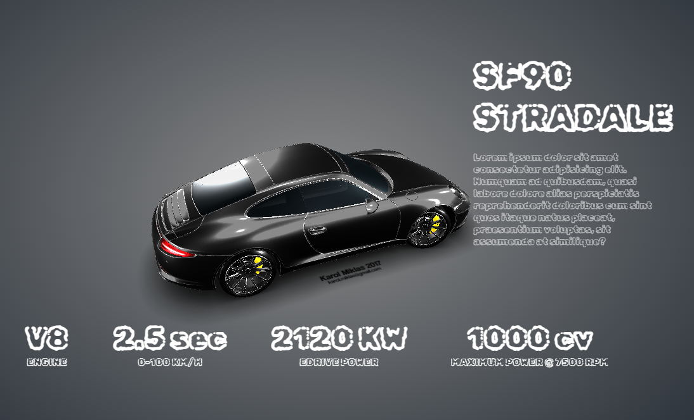

# 3DCar
环境，灯光，相机

这三个术语涉及到3D图形和虚拟现实方面的内容：

1. **Blend（Blender）**：Blender 是一款开源的3D计算机图形软件，它支持建模、动画制作、渲染、视频编辑等功能。Blender 使用的文件格式为 .blend，这是 Blender 专有的文件格式，用于保存 Blender 中的场景、模型、动画等数据。Blender 也支持导出到其他流行的3D文件格式，比如 OBJ、FBX、glTF 等。

2. **USDZ**：USDZ 是由苹果公司和皮克斯合作推出的一种用于增强现实（AR）应用的文件格式。它基于通用场景描述（Universal Scene Description，USD）格式，可以将3D模型、材质、动画等数据打包成一个单一的文件，用于在iOS设备上展示AR内容。USDZ 文件通常用于在移动设备上展示AR应用中的虚拟物体。

3. **glTF（GLB）**：glTF（GL Transmission Format）是一种用于在Web和虚拟现实中传输3D模型的开放标准文件格式。它支持包括模型几何数据、材质、动画、骨骼、光照等信息，并且通常以 .glb 或 .gltf 文件格式进行存储。GLB 是 glTF 的二进制版本，它将所有的模型数据（包括纹理和其他资源）打包成一个二进制文件，方便在Web上快速加载和渲染。

这些格式在3D图形和虚拟现实应用中发挥着重要作用，用于保存和传输3D模型、场景和相关数据。